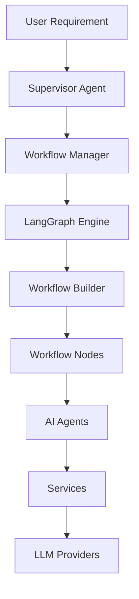
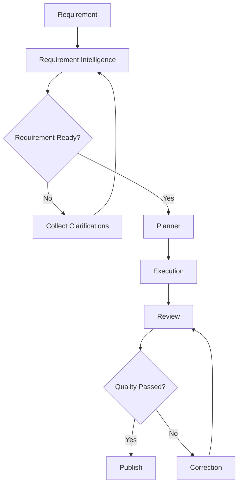
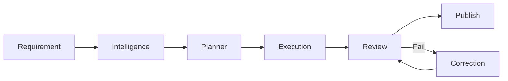

# 🚀 QAgentic

<div align="center">

### AI-Powered Workflow Framework for QA Engineering

Transform software requirements into high-quality QA deliverables using intelligent planning, workflow orchestration, AI review, and automated correction.

**Current Version:** **v0.3.0**

</div>

---

# 📖 Overview

QAgentic is a workflow-driven AI framework that automates the QA lifecycle by combining Large Language Models (LLMs), LangGraph workflow orchestration, modular AI agents, and dependency-aware execution.

Instead of generating isolated outputs, QAgentic analyzes requirements, requests clarification when needed, intelligently plans QA tasks, executes them in the correct order, reviews generated artifacts, automatically corrects low-quality outputs, and publishes approved artifacts.

---

# ✨ Key Features

## 🧠 Requirement Intelligence

* Requirement Analysis
* Intent Extraction
* Interactive Clarification
* Requirement Re-analysis

## 🤖 AI QA Generation

* Requirement Summary Generation
* Functional Test Case Generation
* Automation Script Generation
* Database Artifact Generation

## ⚙ Workflow Engine

* LangGraph Workflow Engine
* Node-based Architecture
* Dependency-aware Task Planning
* Parallel Execution
* Sequential Dependency Execution
* Workflow State Management
* Artifact Publishing

## 🔍 Quality Assurance

* AI Artifact Review
* Automatic Artifact Correction
* Retry Mechanism
* Quality Feedback Loop

## 🏛 Framework Architecture

* Registry Pattern
* Provider Pattern
* Dependency Injection
* Service Layer
* Abstract Base Classes
* Modular Workflow Design

---

# 🏗 High-Level Architecture



---

# 🔄 Workflow Execution



---

# ⚡ Execution Pipeline



---

# 📁 Project Structure

```text
QAgentic
│
├── agents/              AI Agent implementations
├── artifacts/           Artifact management
├── bootstrap/           Application initialization
├── models/              Domain models & workflow state
├── nodes/               Workflow nodes
├── prompts/             Prompt builders
├── providers/           LLM providers
├── registries/          Framework registries
├── services/            Business services
├── workflow/            Workflow engine
├── utils/               Utilities & logging
│
├── app.py               Application entry point
├── config.py            Configuration
└── requirements.txt
```

---

# 🤖 Supported AI Providers

| Provider         |   Status   |
| ---------------- | :--------: |
| Ollama           |      ✅     |
| Groq             |      ✅     |
| Google Gemini    |      ✅     |
| OpenAI           | 🚧 Planned |
| Anthropic Claude | 🚧 Planned |
| Azure OpenAI     | 🚧 Planned |

The provider architecture allows additional AI providers to be integrated without modifying the workflow engine.

---

# ⚙ Requirements

* Python 3.12+
* LangGraph
* At least one supported AI provider

---

# 🚀 Installation

Clone the repository

```bash
git clone https://github.com/<your-username>/QAgentic.git

cd QAgentic
```

Create a virtual environment

```bash
python -m venv .venv
```

Activate the environment

### Windows

```bash
.venv\Scripts\activate
```

Install dependencies

```bash
pip install -r requirements.txt
```

---

# ⚙ Configuration

Create a `.env` file.

Example

```properties
# Ollama
OLLAMA_URL=http://localhost:11434/api/generate

# Groq
GROQ_API_KEY=

# Google Gemini
GEMINI_API_KEY=

# Default Model
MODEL_NAME=

LOG_LEVEL=INFO

OUTPUT_FOLDER=output
```

---

# ▶ Running

```bash
python app.py
```

QAgentic automatically performs:

* Requirement Analysis
* Requirement Clarification (if required)
* Requirement Re-analysis
* Task Planning
* Dependency Resolution
* Parallel Execution
* AI Review
* Automatic Correction
* Artifact Publishing

---

# 📌 Current Architecture

✔ Workflow-driven

✔ LangGraph-based

✔ Modular Nodes

✔ Multi-Agent

✔ Multi-Provider LLM

✔ AI Review Loop

✔ Dependency-aware Planning

✔ Parallel Execution

✔ Artifact Publishing

---

# 🗺 Roadmap

| Version | Status | Highlights                                                |
| ------- | :----: | --------------------------------------------------------- |
| v0.1.0  |   ✅   | Initial AI Agent Framework                                |
| v0.2.0  |   ✅   | Planning, Review & Parallel Execution                     |
| v0.3.0  |   ✅   | LangGraph Workflow, Application Container, Workflow Nodes |
| v0.3.1  |   🚧   | Prompt Service, LLM Request/Response, Agent Profiles      |
| v0.4.0  |   🚧   | LangChain Integration & Memory                            |
| v0.5.0  |   🚧   | Guardrails                                                |
| v0.6.0  |   🚧   | Model Context Protocol (MCP)                              |
| v1.0.0  |   🎯   | Enterprise AI QA Platform                                 |

---

# 🤝 Contributing

Contributions, feature requests, bug reports, and discussions are welcome.

If you'd like to contribute:

1. Fork the repository
2. Create a feature branch
3. Commit your changes
4. Submit a Pull Request

---

# 📄 License

This project is licensed under the **MIT License**.

See the **LICENSE** file for complete details.
