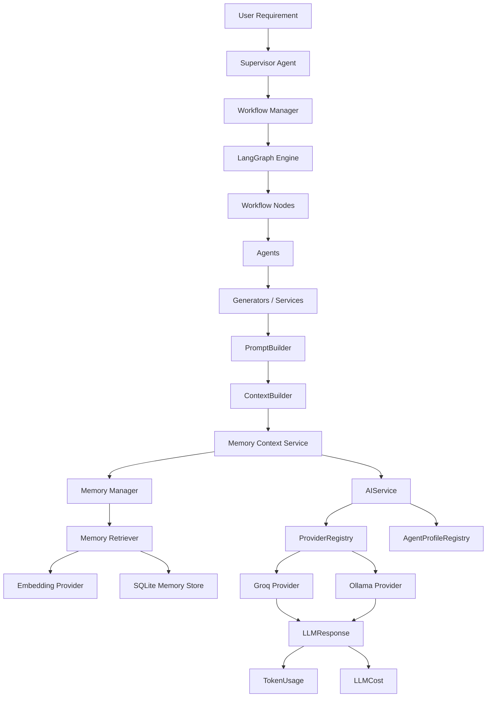
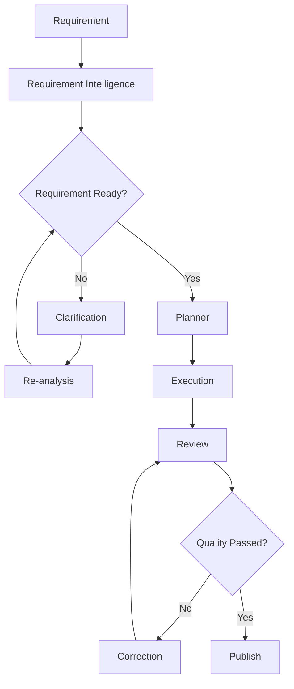

# 🚀 QAgentic

<div align="center">

### AI-Powered Workflow Framework for QA Engineering

Transform software requirements into high-quality QA deliverables using intelligent planning, workflow orchestration, AI review, automatic correction, and artifact publishing.

**Current Version: `v0.5.0`**

</div>

---

## 📖 Overview

QAgentic is a workflow-driven AI framework designed to automate the QA engineering lifecycle.

The framework accepts a software requirement, analyzes its intent, creates an execution plan, resolves task dependencies, executes QA tasks, reviews generated artifacts, automatically corrects failed artifacts, and publishes approved results.

The framework is built around modular agents, workflow orchestration, provider-independent LLM infrastructure, centralized prompt construction, dependency-aware execution, persistent memory, semantic retrieval, and RAG-based knowledge reuse.

---

# ✨ Key Features

## 🧠 Requirement Intelligence

* Requirement analysis
* Intent extraction
* Requirement readiness evaluation
* Interactive clarification
* Requirement re-analysis

## 🤖 AI QA Generation

* Requirement summary generation
* Functional test case generation
* Automation script generation
* Database-related artifact generation
* Generator-specific prompt builders

## ⚙️ Workflow Engine

* LangGraph-based workflow orchestration
* Modular workflow nodes
* Dependency-aware task planning
* Sequential dependency execution
* Parallel execution of independent tasks
* Workflow state management
* Artifact publishing

## 🔍 AI Quality Loop

* AI-generated artifact review
* Automatic correction
* Review → Correction → Review loop
* Quality feedback propagation
* Retry handling

## 🏗️ AI Infrastructure

* Centralized `AIService`
* Provider abstraction
* `ProviderRegistry`
* `AgentProfileRegistry`
* Standardized `LLMRequest`
* Standardized `LLMResponse`
* Centralized `PromptBuilder`
* Centralized `ContextBuilder`
* Provider-independent token tracking
* Model-based LLM pricing
* Per-request LLM cost calculation
* Provider-independent rate-limit handling
* Retry and backoff handling

## 🧠 Knowledge & RAG

* Persistent memory storage using SQLite
* Episodic memory
* Procedural memory
* Embedding-based semantic retrieval
* Semantic similarity search
* Relevance threshold filtering
* Top-K retrieval
* Capability-aware memory queries
* Retrieved memory context construction
* RAG context injection into LLM prompts
* Reusable knowledge across executions

---

# 🏛️ Architecture

The v0.5 architecture separates workflow orchestration, agent logic, prompt construction, AI infrastructure, knowledge retrieval, memory management, and provider-specific implementation.



---

# 🔄 End-to-End Workflow



---

# 🧩 AI Request Architecture

The framework uses provider-independent request and response models.

## LLMRequest

`LLMRequest` represents the information sent to an LLM provider:

```text
LLMRequest
├── system_prompt
├── user_prompt
└── metadata
```

The request model is provider agnostic.

## AgentProfile

`AgentProfile` contains agent-specific model configuration:

```text
AgentProfile
├── agent_name
├── model
├── temperature
└── response_format
```

The provider translates these settings into its own API format.

## LLMResponse

Every provider returns the common response structure:

```text
LLMResponse
├── content
├── provider
├── model
├── token_usage
├── cost
└── metadata
```

This prevents agents and generators from depending on provider-specific response objects.

---

# 🧠 Knowledge & RAG Architecture

QAgentic uses a Retrieval-Augmented Generation (RAG) layer to provide relevant previously stored knowledge to agents during execution.

```text
Agent / Task
     ↓
Memory Query
     ↓
Memory Context Service
     ↓
Memory Manager
     ↓
Memory Retriever
     ↓
Semantic Similarity
     ↓
Relevance Filtering
     ↓
Top-K Memories
     ↓
Memory Context
     ↓
ContextBuilder / PromptBuilder
     ↓
AIService
     ↓
Provider
     ↓
LLM
```

The v0.5 memory layer uses SQLite for persistent storage and embedding-based semantic retrieval.

Retrieved memories are supporting context for generation and are not treated as new user requirements.

## Memory Types

### Episodic Memory

Stores information related to previous execution experiences, outcomes, and relevant runtime history.

### Procedural Memory

Stores reusable QA knowledge, workflow knowledge, and patterns that can help future executions.

## Retrieval

Memory retrieval uses semantic similarity between the current query and stored memories.

```text
Query
  ↓
Query Embedding
  ↓
Candidate Memories
  ↓
Similarity Calculation
  ↓
Relevance Threshold
  ↓
Ranking
  ↓
Top-K Results
  ↓
Memory Context
```

This allows the framework to reuse relevant knowledge without requiring exact keyword matches.

---

# 💰 Token & Cost Tracking

The framework provides centralized LLM usage and cost tracking.

Each successful LLM request can capture:

```text
Input Tokens
Output Tokens
Total Tokens
```

The framework then resolves model pricing and calculates:

```text
Input Cost
Output Cost
Total Cost
```

The provider is responsible for extracting actual token usage.

The centralized AI infrastructure is responsible for calculating cost.

This keeps provider implementations independent from pricing logic.

---

# 🔌 Provider Architecture

Providers implement a common contract:

```python
generate(
    request: LLMRequest,
    profile: AgentProfile
) -> LLMResponse
```

The current provider implementations include:

| Provider         |       Status      |
| ---------------- | :---------------: |
| Groq             |         ✅         |
| Ollama           |         ✅         |
| Google Gemini    | Existing provider |
| OpenAI           |      Planned      |
| Anthropic Claude |      Planned      |
| Azure OpenAI     |      Planned      |

The provider abstraction allows the workflow and agents to remain independent of the underlying LLM provider.

---

# 🧠 Prompt & Context Architecture

Prompt construction is separated from agent execution.

```text
Agent
  ↓
PromptBuilder
  ↓
ContextBuilder
  ↓
System Prompt + User Prompt
  ↓
LLMRequest
  ↓
AIService
```

Individual prompt builders are responsible for their specific agent/task requirements.

The `ContextBuilder` prepares runtime domain information before it reaches the prompt layer.

This prevents agents from directly assembling large provider-specific requests.

---

# 📁 Project Structure

```text
QAgentic/
│
├── agents/
│   ├── base_agent.py
│   ├── execution_agent.py
│   ├── planner_agent.py
│   ├── requirement_agent.py
│   ├── requirement_intelligence_agent.py
│   ├── review_agent.py
│   └── supervisor_agent.py
│
├── ai/
│   ├── builders/
│   │   ├── context_builder.py
│   │   └── prompt_builder.py
│   │
│   ├── config/
│   │   ├── llm_cost.py
│   │   ├── model_pricing.py
│   │   └── pricing_config.py
│   │
│   ├── models/
│   │   ├── llm_request.py
│   │   └── llm_response.py
│   │
│   ├── profiles/
│   │   └── agent_profile.py
│   │
│   ├── prompts/
│   │   ├── prompt_result.py
│   │   └── prompt_template.py
│   │
│   ├── services/
│   │   ├── ai_service.py
│   │   └── pricing_service.py
│   │
│   └── token/
│       ├── token_manager.py
│       └── token_usage.py
│
├── memory/
│   ├── embeddings/
│   ├── episodic/
│   ├── models/
│   ├── procedural/
│   └── stores/
│
├── artifacts/
├── bootstrap/
├── constants/
├── models/
├── prompts/
├── providers/
├── registries/
├── services/
├── utils/
│
├── workflow/
│   ├── nodes/
│   └── workflow_routers/
│
├── app.py
├── config.py
├── requirements.txt
├── CHANGELOG.md
└── LICENSE
```

---

# ⚙️ Requirements

* Python 3.12+
* Dependencies listed in `requirements.txt`
* At least one configured LLM provider
* SQLite for persistent local memory
* Embedding model support for semantic memory retrieval

---

# 🚀 Installation

Clone the repository:

```bash
git clone https://github.com/<your-username>/QAgentic.git
cd QAgentic
```

Create a virtual environment:

```bash
python -m venv .venv
```

Activate it on Windows:

```bash
.venv\Scripts\activate
```

Install dependencies:

```bash
pip install -r requirements.txt
```

---

# 🔐 Configuration

Create a local `.env` file using `.env.example` as the template.

Example:

```properties
LLM_PROVIDER=groq

# Groq
GROQ_API_KEY=

# Google Gemini
GEMINI_API_KEY=

# Ollama - required when using Ollama
OLLAMA_URL=http://localhost:11434/api/generate
MODEL_NAME=

# Logging
LOG_LEVEL=INFO

# Output
OUTPUT_FOLDER=generated
```

Never commit `.env` or API credentials to Git.

---

# ▶️ Running the Framework

```bash
python app.py
```

QAgentic can execute the complete QA workflow:

```text
Requirement
    ↓
Requirement Intelligence
    ↓
Clarification when required
    ↓
Planning
    ↓
Task Execution
    ↓
Memory / RAG Context
    ↓
Artifact Review
    ↓
Correction when required
    ↓
Re-review
    ↓
Artifact Publishing
```

---

# 📊 v0.5 Architecture Highlights

Version `0.5.0` introduces the Knowledge and RAG foundation.

### Added

* Persistent SQLite memory
* Episodic memory
* Procedural memory
* Memory models and policies
* Embedding-based semantic retrieval
* Similarity-based relevance filtering
* Top-K retrieval
* Capability-aware memory queries
* Memory context construction
* RAG context integration with agent prompts
* Reusable knowledge across executions
* Provider-independent rate-limit handling
* Retry and backoff support

### Improved

* Reusable knowledge across executions
* Context-aware agent generation
* Separation of stored knowledge from runtime requirements
* Semantic retrieval instead of exact keyword-only matching
* Centralized memory context construction
* Provider-independent AI infrastructure

---

# ⚠️ Known Limitations

The v0.5 release focuses on establishing the knowledge and RAG foundation.

* External repository/document indexing is not part of v0.5.
* MCP-based external tool execution is not part of v0.5.
* Tool authorization policies are not part of v0.5.
* Guardrails and human approval workflows are planned for v0.6.
* Autonomous test execution and self-healing capabilities are planned for future releases.
* Advanced external knowledge sources are planned for future versions.

---

# 🗺️ Roadmap

| Version | Status | Focus |
| ------- | :----: | ----- |
| v0.1.0 |    ✅   | Initial AI QA framework |
| v0.2.0 |    ✅   | Planning, review and parallel execution |
| v0.3.0 |    ✅   | LangGraph workflow, application container and workflow nodes |
| v0.4.0 |    ✅   | AI infrastructure, provider abstraction, agent profiles, prompt/context architecture, token and cost tracking |
| v0.5.0 |    ✅   | Knowledge, memory, embeddings and RAG foundation |
| v0.6.0 |    🚧   | MCP, tool execution, guardrails and human approval |
| v0.7.0 |    🚧   | Intelligent QA capabilities |
| v0.8.0 |    🚧   | Enterprise integrations |
| v0.9.0 |    🚧   | Advanced QA intelligence |
| v1.0.0 |    🎯   | Production AI-QA platform |

## v0.6 — MCP + Tool Execution + Guardrails

The next version will establish the infrastructure required for AI agents to interact with external systems safely.

Planned areas include:

* MCP client/tool integration
* Tool discovery and execution
* Tool authorization
* Guardrail evaluation
* Human approval for sensitive operations
* Controlled repository interaction
* Controlled test execution
* External system integration foundations

## v0.7 — Intelligent QA Capabilities

Planned capabilities include:

* Self-Healing Capability
* UI ↔ Database Validation Capability
* Failure Diagnosis Capability
* CI/CD Pipeline Recovery Capability
* Kafka / Staging Validation Capability

Capabilities may internally use agents, services, tools, MCP integrations, and retrieved knowledge.

### Terminology

**Capability**

A QA operation that the platform can perform.

**Agent**

An LLM-driven reasoning component that may implement part of a capability.

**Tool / MCP**

The mechanism through which agents interact with external systems.

**RAG / Knowledge Layer**

The mechanism used to retrieve relevant stored knowledge and provide it as context during reasoning.

---

# 🤝 Contributing

Contributions, feature requests, bug reports, and discussions are welcome.

If you'd like to contribute:

1. Fork the repository
2. Create a feature branch
3. Implement your changes
4. Add or update tests where applicable
5. Commit your changes
6. Submit a Pull Request

---

# 📄 License

This project is licensed under the MIT License.

See the `LICENSE` file for complete details.
