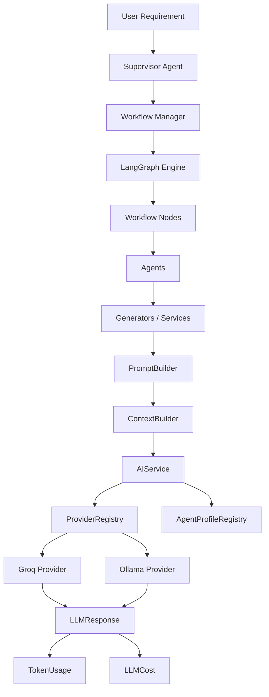
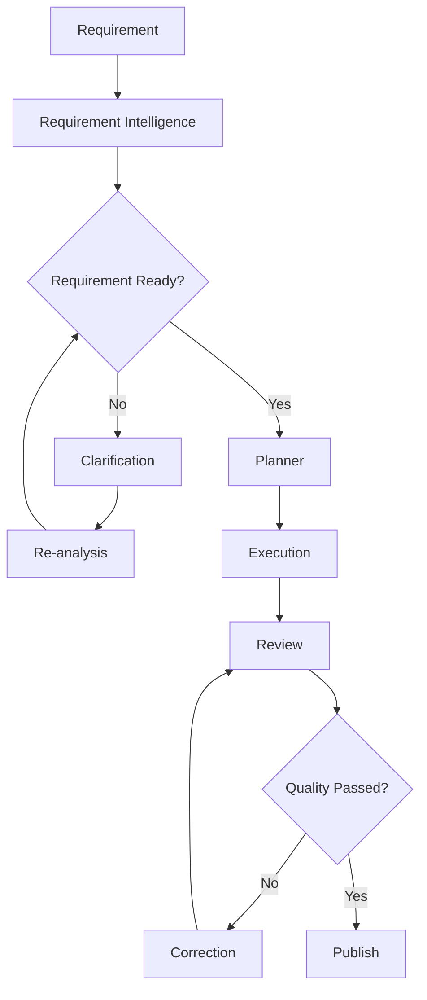

# 🚀 QAgentic

<div align="center">

### AI-Powered Workflow Framework for QA Engineering

Transform software requirements into high-quality QA deliverables using intelligent planning, workflow orchestration, AI review, automatic correction, and artifact publishing.

**Current Version: `v0.4.0`**

</div>

---

## 📖 Overview

QAgentic is a workflow-driven AI framework designed to automate the QA engineering lifecycle.

The framework accepts a software requirement, analyzes its intent, creates an execution plan, resolves task dependencies, executes QA tasks, reviews generated artifacts, automatically corrects failed artifacts, and publishes approved results.

The framework is built around modular agents, workflow orchestration, provider-independent LLM infrastructure, centralized prompt construction, and dependency-aware execution.

---

# ✨ Key Features

## 🧠 Requirement Intelligence

* Requirement analysis
* Intent extraction
* Requirement readiness evaluation
* Interactive clarification
* Requirement re-analysis

## 🤖 AI QA Generation

* Requirement summary generation
* Functional test case generation
* Automation script generation
* Database-related artifact generation
* Generator-specific prompt builders

## ⚙️ Workflow Engine

* LangGraph-based workflow orchestration
* Modular workflow nodes
* Dependency-aware task planning
* Sequential dependency execution
* Parallel execution of independent tasks
* Workflow state management
* Artifact publishing

## 🔍 AI Quality Loop

* AI-generated artifact review
* Automatic correction
* Review → Correction → Review loop
* Quality feedback propagation
* Retry handling

## 🏗️ AI Infrastructure

* Centralized `AIService`
* Provider abstraction
* `ProviderRegistry`
* `AgentProfileRegistry`
* Standardized `LLMRequest`
* Standardized `LLMResponse`
* Centralized `PromptBuilder`
* Centralized `ContextBuilder`
* Provider-independent token tracking
* Model-based LLM pricing
* Per-request LLM cost calculation

---

# 🏛️ Architecture

The v0.4 architecture separates workflow orchestration, agent logic, prompt construction, AI infrastructure, and provider-specific implementation.



---

# 🔄 End-to-End Workflow



---

# 🧩 AI Request Architecture

The framework uses provider-independent request and response models.

## LLMRequest

`LLMRequest` represents the information sent to an LLM provider:

```text
LLMRequest
├── system_prompt
├── user_prompt
└── metadata
```

The request model is provider agnostic.

## AgentProfile

`AgentProfile` contains agent-specific model configuration:

```text
AgentProfile
├── agent_name
├── model
├── temperature
└── response_format
```

The provider translates these settings into its own API format.

## LLMResponse

Every provider returns the common response structure:

```text
LLMResponse
├── content
├── provider
├── model
├── token_usage
├── cost
└── metadata
```

This prevents agents and generators from depending on provider-specific response objects.

---

# 💰 Token & Cost Tracking

v0.4 introduces centralized LLM usage and cost tracking.

Each successful LLM request can capture:

```text
Input Tokens
Output Tokens
Total Tokens
```

The framework then resolves model pricing and calculates:

```text
Input Cost
Output Cost
Total Cost
```

The provider is responsible for extracting actual token usage.

The centralized AI infrastructure is responsible for calculating cost.

This keeps provider implementations independent from pricing logic.

---

# 🔌 Provider Architecture

Providers implement a common contract:

```python
generate(
    request: LLMRequest,
    profile: AgentProfile
) -> LLMResponse
```

The current provider implementations include:

| Provider         |       Status      |
| ---------------- | :---------------: |
| Groq             |         ✅         |
| Ollama           |         ✅         |
| Google Gemini    | Existing provider |
| OpenAI           |      Planned      |
| Anthropic Claude |      Planned      |
| Azure OpenAI     |      Planned      |

The provider abstraction allows the workflow and agents to remain independent of the underlying LLM provider.

---

# 🧠 Prompt & Context Architecture

Prompt construction is separated from agent execution.

```text
Agent
  ↓
PromptBuilder
  ↓
ContextBuilder
  ↓
System Prompt + User Prompt
  ↓
LLMRequest
  ↓
AIService
```

Individual prompt builders are responsible for their specific agent/task requirements.

The `ContextBuilder` prepares runtime domain information before it reaches the prompt layer.

This prevents agents from directly assembling large provider-specific requests.

---

# 📁 Project Structure

```text
QAgentic/
│
├── agents/
│   ├── base_agent.py
│   ├── execution_agent.py
│   ├── planner_agent.py
│   ├── requirement_agent.py
│   ├── requirement_intelligence_agent.py
│   ├── review_agent.py
│   └── supervisor_agent.py
│
├── ai/
│   ├── builders/
│   │   ├── context_builder.py
│   │   └── prompt_builder.py
│   │
│   ├── config/
│   │   ├── llm_cost.py
│   │   ├── model_pricing.py
│   │   └── pricing_config.py
│   │
│   ├── models/
│   │   ├── llm_request.py
│   │   └── llm_response.py
│   │
│   ├── profiles/
│   │   └── agent_profile.py
│   │
│   ├── prompts/
│   │   ├── prompt_result.py
│   │   └── prompt_template.py
│   │
│   ├── services/
│   │   ├── ai_service.py
│   │   └── pricing_service.py
│   │
│   └── token/
│       ├── token_manager.py
│       └── token_usage.py
│
├── artifacts/
├── bootstrap/
├── constants/
├── models/
├── prompts/
├── providers/
├── registries/
├── services/
├── utils/
│
├── workflow/
│   ├── nodes/
│   └── workflow_routers/
│
├── app.py
├── config.py
├── requirements.txt
├── CHANGELOG.md
└── LICENSE
```

---

# ⚙️ Requirements

* Python 3.12+
* Dependencies listed in `requirements.txt`
* At least one configured LLM provider

---

# 🚀 Installation

Clone the repository:

```bash
git clone https://github.com/<your-username>/QAgentic.git
cd QAgentic
```

Create a virtual environment:

```bash
python -m venv .venv
```

Activate it on Windows:

```bash
.venv\Scripts\activate
```

Install dependencies:

```bash
pip install -r requirements.txt
```

---

# 🔐 Configuration

Create a local `.env` file.

Example:

```properties
# Ollama
OLLAMA_URL=http://localhost:11434/api/generate

# Groq
GROQ_API_KEY=

# Google Gemini
GEMINI_API_KEY=

# Default model configuration
MODEL_NAME=

# Logging
LOG_LEVEL=INFO

# Output
OUTPUT_FOLDER=output
```

Never commit `.env` or API credentials to Git.

---

# ▶️ Running the Framework

```bash
python app.py
```

QAgentic can execute the complete QA workflow:

```text
Requirement
    ↓
Requirement Intelligence
    ↓
Planning
    ↓
Task Execution
    ↓
Artifact Review
    ↓
Correction when required
    ↓
Re-review
    ↓
Artifact Publishing
```

---

# 📊 v0.4 Architecture Highlights

Version `0.4.0` establishes the provider-independent AI infrastructure layer.

### Added

* Agent profiles
* Provider abstraction
* Standard LLM request model
* Standard LLM response model
* Central AI service
* Prompt builder architecture
* Context builder architecture
* Token usage tracking
* Model pricing configuration
* LLM cost calculation
* Standardized Groq provider
* Standardized Ollama provider

### Improved

* Separation of prompt construction from agent logic
* Separation of runtime context from prompt construction
* Provider-independent response handling
* Centralized LLM usage and cost accounting
* Removal of the legacy LLM service path

---

# ⚠️ Known Limitations

Large review/correction contexts can exceed the token-per-minute limits imposed by an LLM provider.

Context minimization and more advanced context management are intentionally deferred to a future version.

This does not change the v0.4 architecture or workflow design.

---

# 🗺️ Roadmap

| Version | Status | Focus                                                                                  |
| ------- | :----: | -------------------------------------------------------------------------------------- |
| v0.1.0  |    ✅   | Initial AI QA framework                                                                |
| v0.2.0  |    ✅   | Planning, review and parallel execution                                                |
| v0.3.0  |    ✅   | LangGraph workflow, application container and workflow nodes                           |
| v0.4.0  |    ✅   | AI infrastructure, agent profiles, prompt/context abstraction, token and cost tracking |
| v0.5.0  |   🚧   | Memory architecture                                                                    |
| Future  |   🚧   | RAG and retrieval                                                                      |
| Future  |   🚧   | Confidence, evaluation and quality intelligence                                        |
| Future  |   🚧   | Advanced prompt/template architecture and LangChain/LangGraph evolution                |
| v1.0.0  |   🎯   | Enterprise AI QA platform                                                              |

---

# 🤝 Contributing

Contributions, feature requests, bug reports, and discussions are welcome.

If you'd like to contribute:

1. Fork the repository
2. Create a feature branch
3. Implement your changes
4. Add or update tests where applicable
5. Commit your changes
6. Submit a Pull Request

---

# 📄 License

This project is licensed under the MIT License.

See the `LICENSE` file for complete details.
